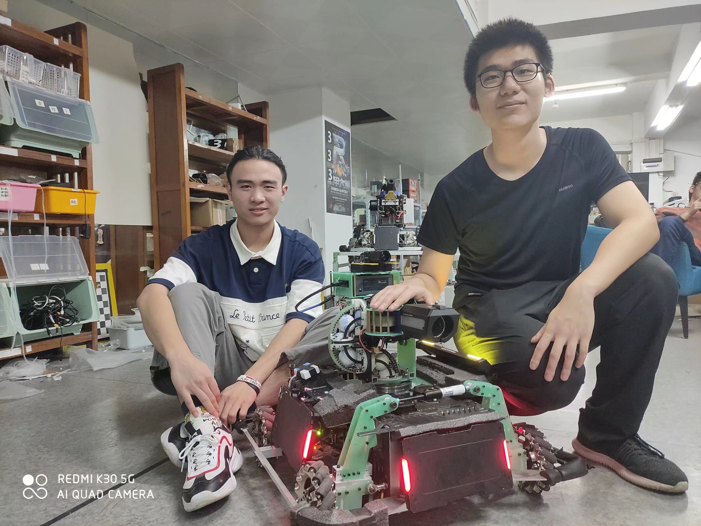
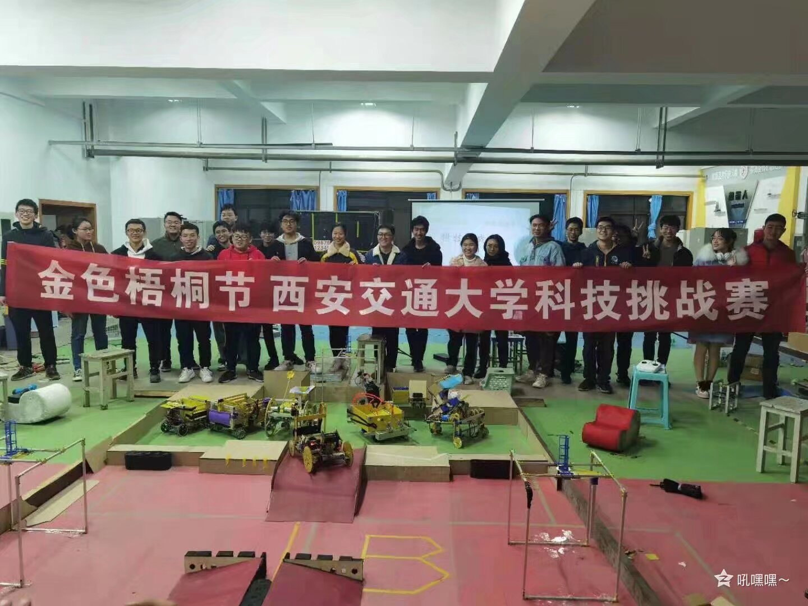
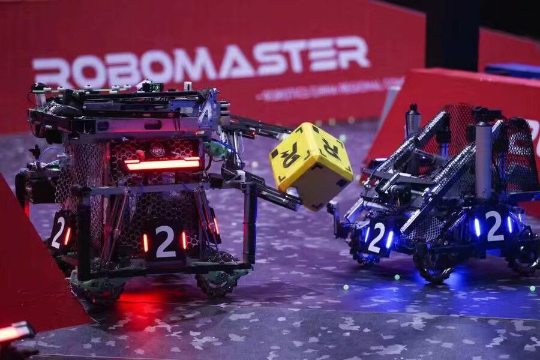
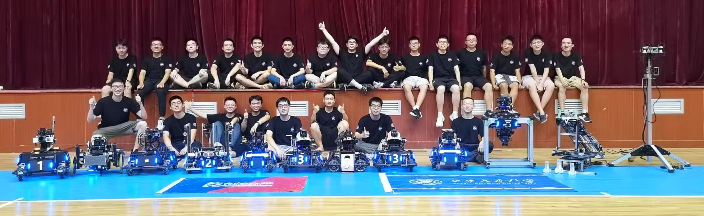
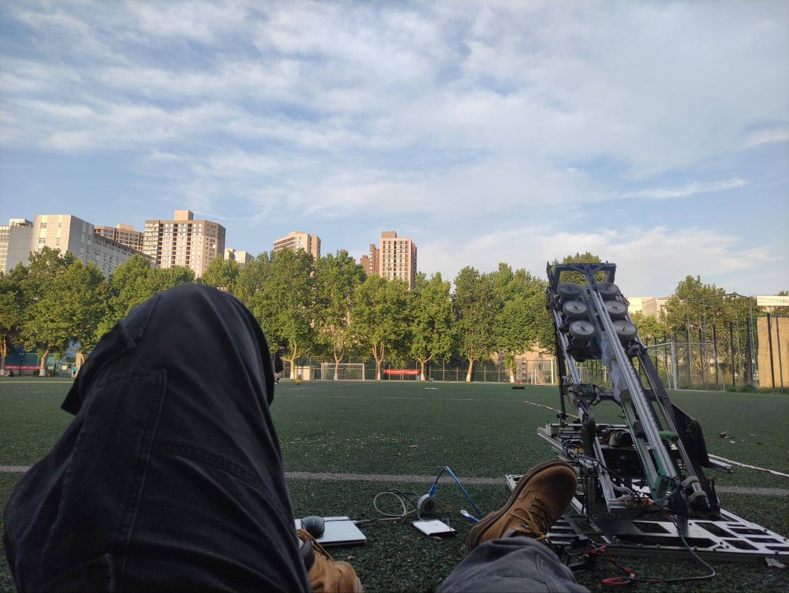
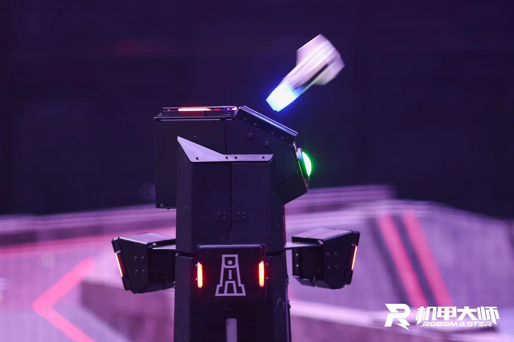
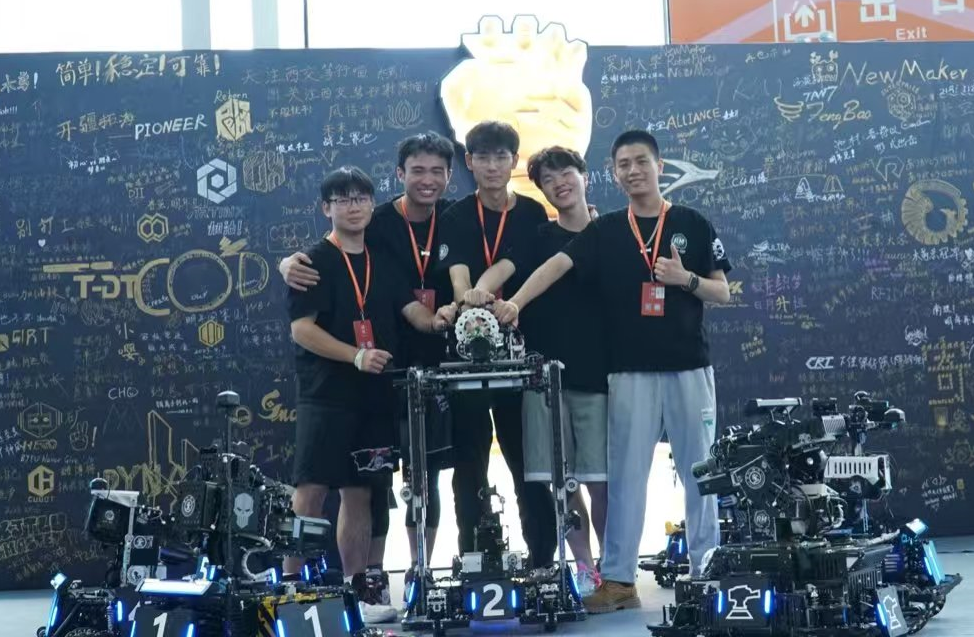
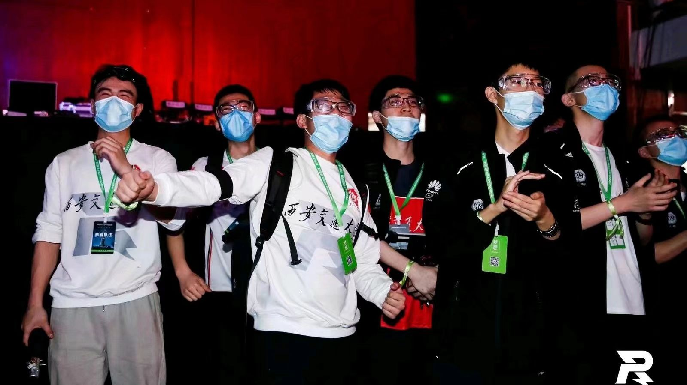
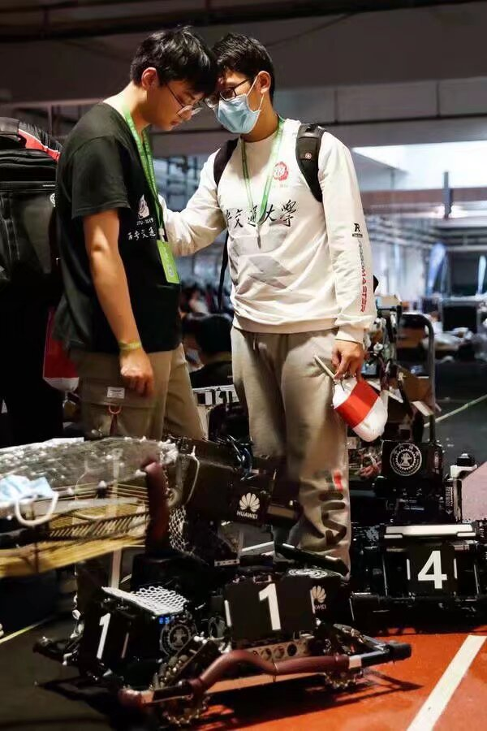
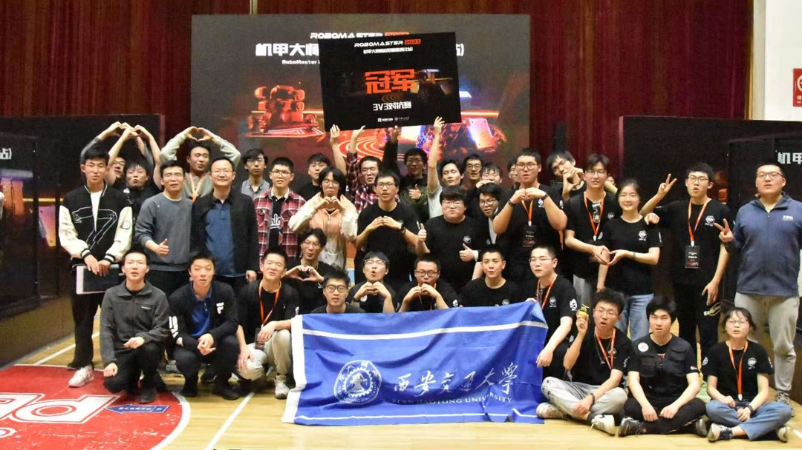

# RoboMaster 经历

## 关于 RoboMaster
全国大学生机器人大赛 [**RoboMaster 机甲大师超级对抗赛**](https://www.robomaster.com/zh-CN/robo/rm?djifrom=nav)（RMUC, RoboMaster University Championship），侧重考察参赛队员对理工学科的综合应用与工程实践能力，充分融合了“机器视觉”、“嵌入式系统设计”、“机械工程”、“自主导航”、“人机交互”等众多机器人相关技术学科，同时创新性地将流行呈现方式与机器人竞技相结合，使机器人对抗更加直观激烈，吸引了众多的科技爱好者和社会公众的广泛关注。

## 我的机甲大师旅程

### 2020年：英雄机器人底盘设计
- 学习CAE/CAM软件使用和机械结构设计知识
- 负责英雄机器人底盘设计，采用多自由度连杆机构的麦克纳姆轮底盘

  
   
  <em style="display: inline-block; width: 48%;">2020届英雄机器人机械研发成员</em>

### 2021年：机械组组长
- 制作培训课程，帮助新成员入门机械结构设计
- 定期检查机械组工作进度，审核机械结构设计并提供建议
- 设计带有滚轮的夹爪结构，用于快速获取和储存方块道具
- 赛季总结：成绩不理想，机器人稳定性不足，为后续发展积累了宝贵经验

  
  
   
  <em style="display: inline-block; width: 48%;">和RoboCon队伍合办校内机器人比赛，检验培训成果</em>
  <em style="display: inline-block; width: 48%;">工程机器人（左）的赛场表现</em>

### 2022年：队长
队伍重建与目标制定：
- 重新组建团队，招募充满激情，实力过硬的新成员
- 确立明确目标：进入全国前8强
- 专注基础功能稳定性，重点突破强势性能

  
   
  <em style="display: inline-block; width: 90%;">笃行2022届团队</em>

团队管理优化：
- 简化流程，减少不必要的报告和会议
- 负责快速审核和支付研发经费，提升团队效率

工程机器人研发：
- 设计气动吸盘交互机构，负压可达76kpa，吸附耗时＜0.3s
- 创新两段式大行程升降机构和吸盘伸缩机构，设计简洁高效
- 充分考虑维护便利性，调试、更换部件和维修都十分便捷

飞镖系统研发：
- 设计模块化镖体和滚珠丝杠控制的发射架
- 命中率达到60%以上，在全国实战数据中排名第4

  
  
   
  <em style="display: inline-block; width: 48%;">我在操场上测试飞镖</em>
  <em style="display: inline-block; width: 48%;">我们的飞镖命中瞬间</em>

- 经过大半个赛季的努力，我们重新获得国赛资格，走出低谷期

  
   
  <em style="display: inline-block; width: 50%;">赢下这场比赛后，我们拿到了国赛的门票</em>

### 2023年：顾问
- 设计多自由度机械臂和大行程变形机构为核心的工程机器人
- 贯彻简洁高效的设计思路，表现出色
- 成果：团队进入全国十六强，实现历史性突破

  
  
   
  <em style="display: inline-block; width: 48%;">2023届工程组成员</em>
  <em style="display: inline-block; width: 48%;">机器人赛场表现</em>

### 2024年：顾问
- 为队员提供技术支持，协助赛季规划和创新项目研发
- 成果：团队刷新历史记录，进入全国前12强

  
   
  <em style="display: inline-block; width: 48%;">笃行2024届团队</em>

## 我们团队的历史 - **笃行**
很荣幸能加入西安交通大学**笃行**机器人队，在这里收获了珍贵的友谊，也成长为一名优秀的机械工程师。希望**笃行**在未来不断发展壮大。

  
  
   
  <em style="display: inline-block; width: 76%;">2021届分区赛现场</em>
  <em style="display: inline-block; width: 20%;">分区赛遗憾淘汰</em>

  
  
   
  <em style="display: inline-block; width: 68%;">2022届重回国赛</em>
  <em style="display: inline-block; width: 28%;">2022分区赛操作间</em>

  
  
   
  <em style="display: inline-block; width: 48%;">2023届联盟赛冠军</em>
  <em style="display: inline-block; width: 48%;">2023届全国16强</em>

  
  
   
  <em style="display: inline-block; width: 50%;">2024届取得全国12强</em>

