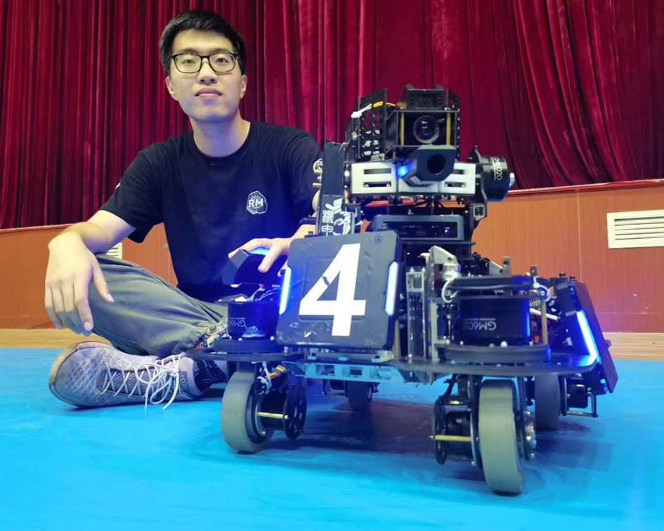
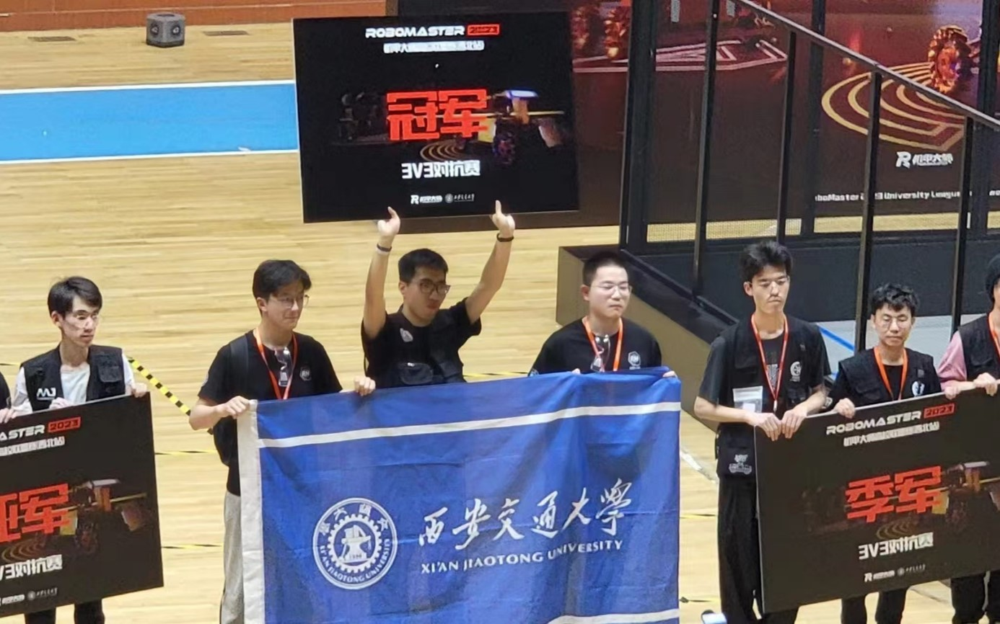
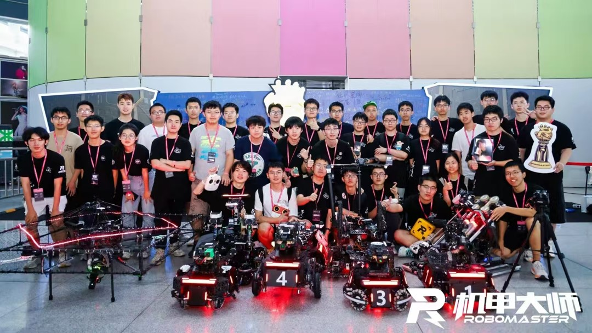

# RoboMaster 经历

## 关于 RoboMaster
[**RoboMaster机甲大师赛**](https://www.robomaster.com/zh-CN)是由大疆创新举办的年度机器人竞赛，大学团队设计机器人参与各种挑战。比赛强调机器人技术的创新、团队合作和技术技能，包括机械设计、电子技术和软件开发。

## 我的 RoboMaster 之路

### 2021年：哨兵机器人底盘设计
作为机械团队的一员，我设计了哨兵机器人的底盘，通过机械工程原理和结构优化专注于稳定性和机动性。

### 2022年：步兵机器人底盘设计
我设计了步兵机器人底盘，优先考虑速度、耐用性和对各种地形的适应性，提升了团队的竞技表现。

  
  
   
  <em style="display: inline-block; width: 48%;">我为步兵机器人系列设计的创新方案，展现了功能性与创造性的完美结合。</em>

### 2023年：队长
作为队长，我带领团队达到了历史最佳成绩，进入全国前16强。我的职责包括战略规划、团队协调以及优化机器人设计和性能。

  
  
   
  <em style="display: inline-block; width: 48%;">2023年RoboMaster比赛中担任队长期间的领导风采。</em>
  <em style="display: inline-block; width: 48%;">我们团队历史上的首个冠军。</em>

### 2024年：技术顾问
转任技术顾问后，我指导团队打破历史记录，进入全国前12强，展现了持续的改进和创新。

  
   
  <em style="display: inline-block; width: 50%;">参与训练竞赛</em>

## 我们团队的历史 - **笃行**
I am truly honored to have spent my undergraduate years as part of the **DuXing** Robotics Team at Xi'an Jiaotong University. This remarkable team has not only provided me with invaluable friendships but also extraordinary opportunities for personal and professional growth. I sincerely hope that the **DuXing** team will continue to push boundaries, reach new heights, and achieve even greater success in the future.

  
  
   
  <em style="display: inline-block; width: 48%;">Our team's first championship in history (April 2023).</em>
  <em style="display: inline-block; width: 48%;">Returning to Shenzhen for the National Competition(August 2023).</em>

  
  
   
  <em style="display: inline-block; width: 50%;">Achieving our team's best historical record - Top 12 (May 2024 - August 2024).</em>

