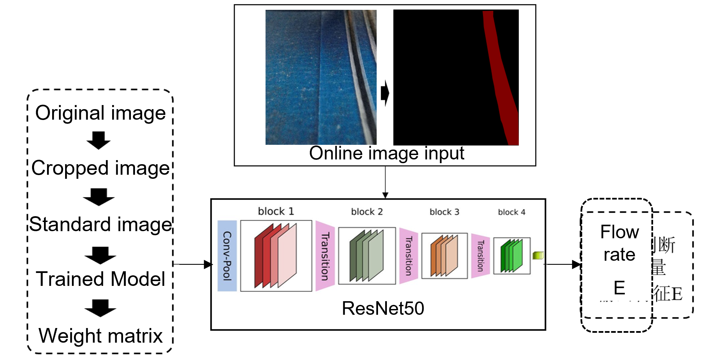

# 超材料逆向设计

超材料逆向设计方法利用机器学习创建多样化、高精度的结构，具有定制化特性。该研究提升了设计多样性并加速了分析过程，能够实现对机械刺激的精确响应，应用于先进复合材料和自适应结构。

<!-- 

  

 -->

# 移动机器人开发

*(专注于全向机器人技术和基于无人机的行人轨迹预测的详细综合研究项目将在**7月5日**之前进行全面更新和完善。)*

  

# 3D打印在线监控

移动3D打印机器人通过集成动态、灵活的底盘，彻底革新了增材制造，显著扩展了超越传统限制的打印区域。这一创新设计增强了移动性和适应性，为先进制造和自适应建造中的大规模、高精度制造提供了可能。

  

