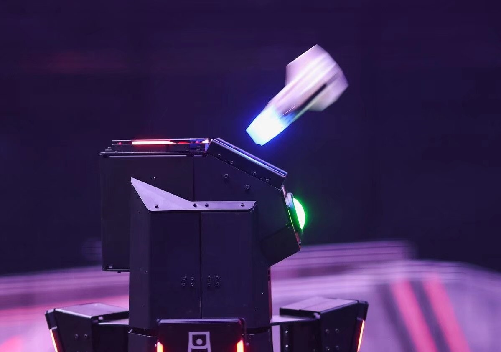
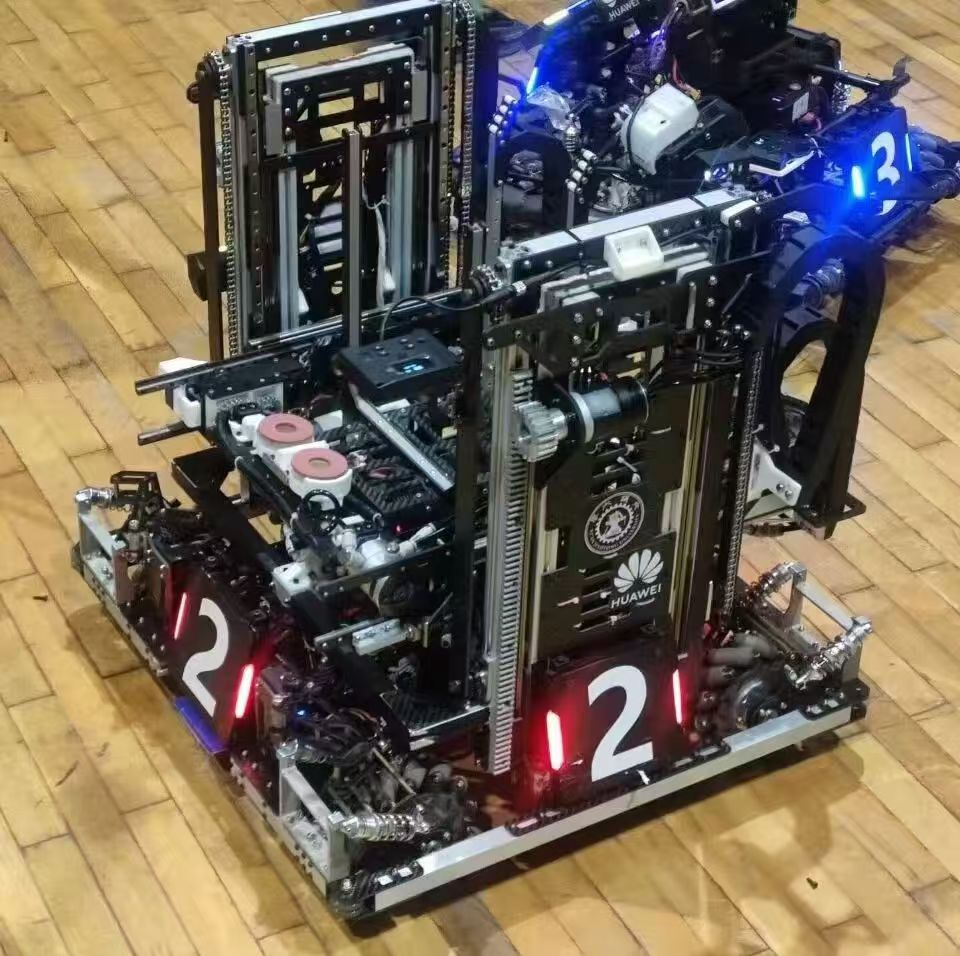
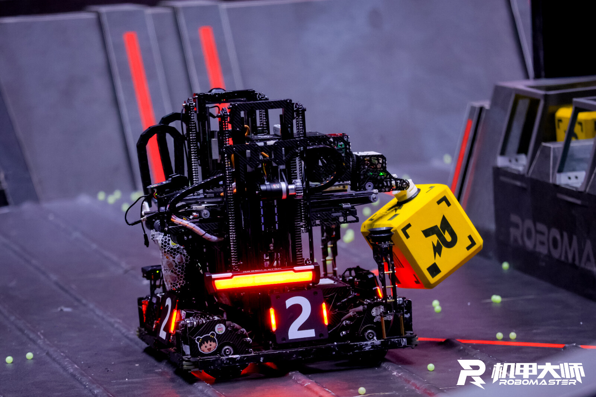
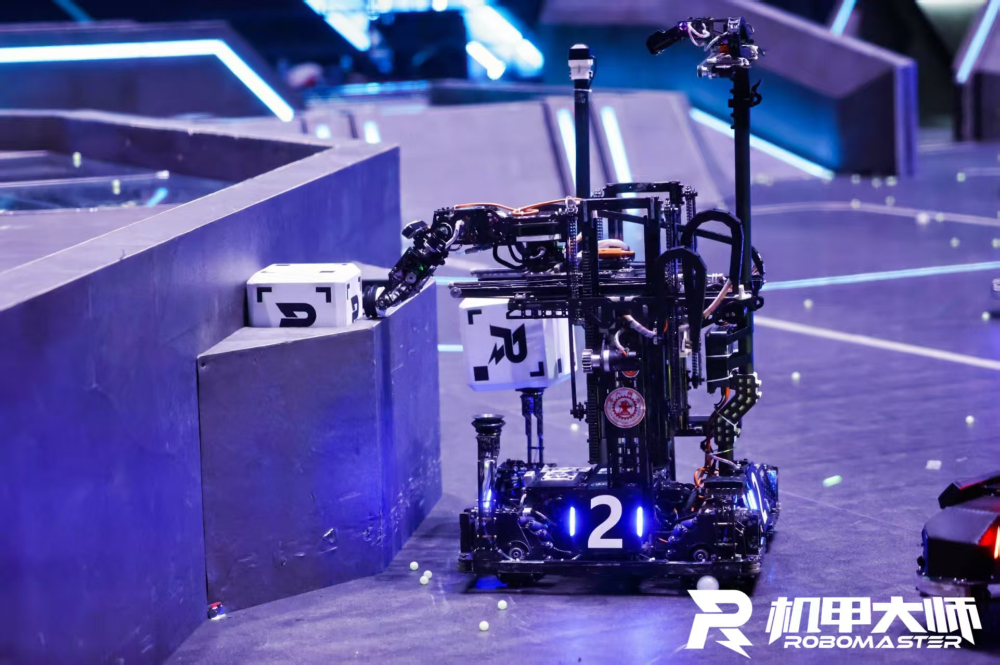
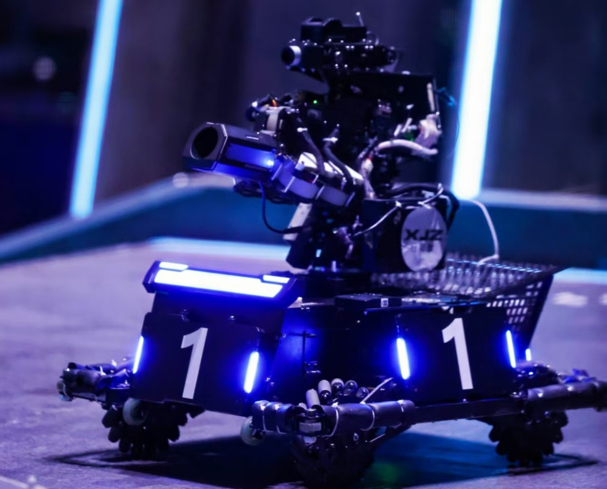

# 移动机器人设计

基于RoboMaster机甲大师赛项目经验，专注于复杂机械系统的设计与优化。研究涵盖多自由度机械臂、全向移动底盘、变形机构等关键技术，通过创新的机械结构设计实现机器人在复杂环境中的高效作业。核心技术包括气动系统设计、精密传动机构、模块化结构设计等，为智能机器人系统提供稳定可靠的机械基础。

  
  
  

  
  
  

# 基于事件相机的视觉测振系统开发

开发基于事件相机的机械装备微振动非接触式测量系统，结合动态视觉信号处理技术和机械臂辅助功能，实现高精度振动检测。

**核心技术特点：**
- 提出针对DVS的时空维度密度聚类算法，噪声去除达82%以上
- 设计振动重构算法，实现从DVS中提取机械结构微振动成分
- 开发符合工程应用场景的动态视觉测振边缘端设备
- 完成人机交互软件，实现实时时频域分析

  

